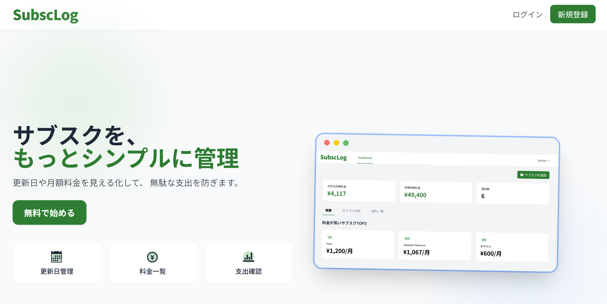
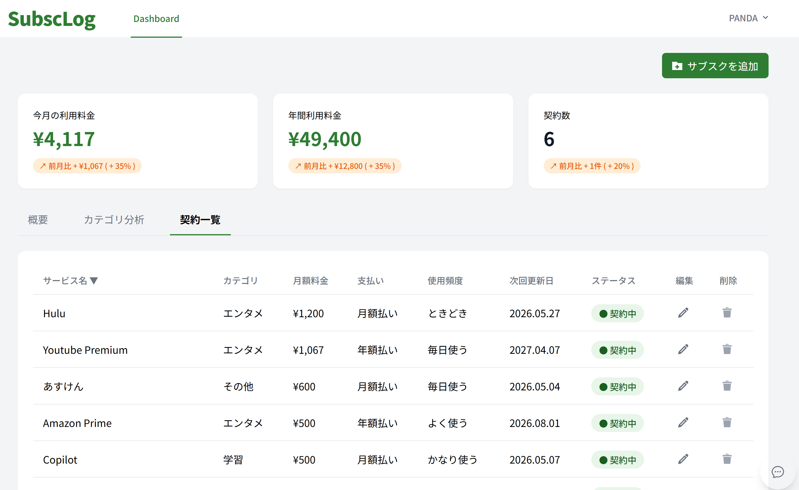

# SubscLog（サブスク管理アプリ）
---
サブスクリプションサービスを一元管理し、月額支出の可視化と最適化を目的としたWebアプリです。
登録されたサブスク情報をもとに、AIが支出状況を分析し、簡単なアドバイスを提供します。

※未デプロイ（ローカル環境で動作）

  
  

---
# 使用技術

### フロントエンド
- Blade（Laravel）
- Tailwind CSS
- JavaScript（fetch API）

### バックエンド
- Laravel

### データベース
- PostgreSQL

### 開発環境
- Docker（Laravel Sail）

### 外部サービス
- OpenAI API

---
インフラ構成

未構築

---
# 主な機能
### ユーザー認証機能
### サブスク登録・管理機能
- サブスクサービスの登録
- サブスクサービスの編集・削除
- 契約中・解約済みのステータス管理
- 利用頻度の記録

### 次回更新日リマインダー機能
### ダッシュボード機能
- カテゴリ別利用金額の表示
- 合計金額の表示
- サブスク一覧の表示
### AIコンシェルジュ機能(Ajax)
